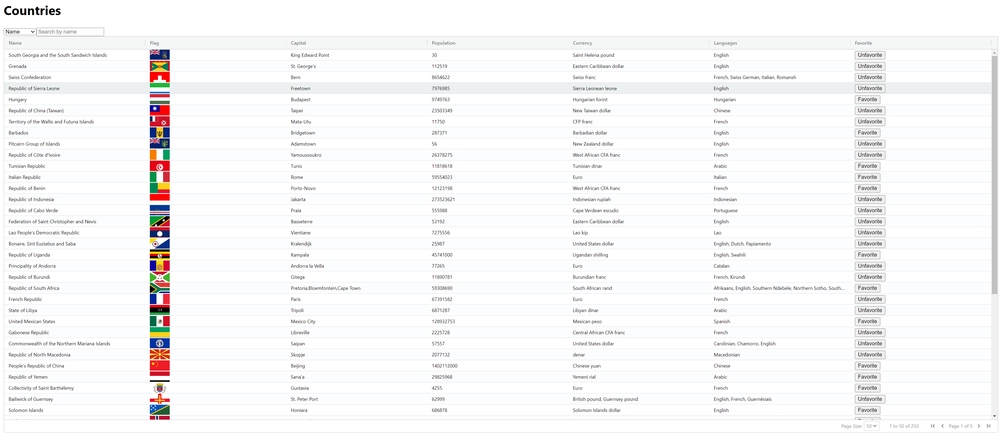

# Countries Table Application

## Overview

This app displays a list of countries with various attributes in a table format. Users can search for countries and mark their favorite countries.



## Installation

### 1. Install the dependencies

```
npm install
# or
yarn install
```

### 2. Start the client in development mode.

```
npm run dev
# or
yarn dev
```

### 3. Visit `http://localhost:5173/` to view the app.

## React Libaries used

- **@tanstack/react-query**: A library for fetching, caching, and updating server state in React applications.
- **axios**: A promise-based HTTP client for making requests to APIs.
- **typescript**: A typed superset of JavaScript that compiles to plain JavaScript.
  vite: A build tool that provides a faster and leaner development experience for modern web projects.

## Work In Progress

- **Detailed Country View**: Add functionality to view detailed information for each country when selected.
- **Enhanced Pagination**: Implement advanced pagination techniques using useInfiniteQuery from react-query and possibly react-intersection-observer for infinite scrolling.
- **Code Refactoring**: Modularize and refactor code for better reusability and maintainability through compound components.
- **Testing**: Introduce unit and integration tests using Jest, Vitest, or React Testing Library to ensure code quality and reliability.

## License

This project is licensed under the MIT License. See the LICENSE file for details.
